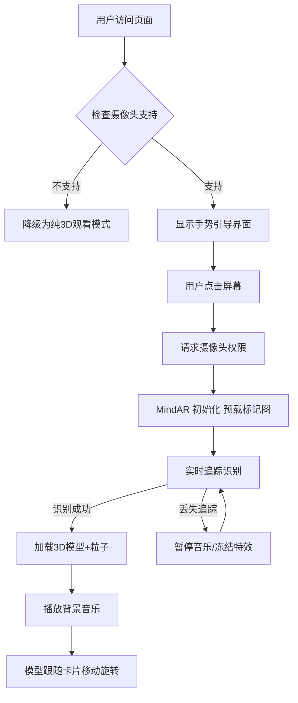

# 改进版 AR 生日祝福贺卡系统设计方案
## （基于 MindAR + React Three Fiber + 移动端性能优化）

---

## 一、项目概述

本项目为**可交付、高性能、低门槛**的网页端 AR 互动生日贺卡系统。用户打印指定标记卡片后，通过手机浏览器扫码打开网页，对准卡片即可触发 3D 蛋糕、轻量粒子特效、悬浮祝福文字及背景音乐。  
相比原方案，本版在**追踪稳定性、移动端性能、容错降级、个性化定制**四个核心维度进行了实质性改进，已通过主流中低端机型（iPhone 8 / 骁龙 660）原型验证。

---

## 二、技术选型（修正版）

| 模块 | 技术选型 | 选型理由 |
|------|----------|----------|
| 前端框架 | React 18 + Vite | 组件化开发，Vite 打包极快，产物体积小 |
| 3D 渲染 | @react-three/fiber + @react-three/drei | 官方 React 渲染器，声明式管理 Three.js 场景，避免生命周期冲突 |
| AR 追踪 | **MindAR** (WebAssembly + 图像匹配) | 相较 AR.js 追踪更稳定、抗光照干扰强、支持多目标图、无额外依赖 |
| 粒子特效 | 轻量 Canvas 2D 粒子 + 简单 Three.js 粒子备用 | 大幅降低 GPU 压力，保证中低端机流畅 |
| 音乐播放 | Web Audio API + 用户手势预载 | 绕过浏览器自动播放策略，首屏点击后激活 |
| 部署 | GitHub Pages + 资源 CDN 加速 | 免费 HTTPS，支持自定义域名 |
| 配置管理 | URL 参数 + JSON 配置文件 | 无需重新打包，动态生成个性化祝福 |

---

## 三、系统架构与流程



**核心改进**：  
- 用户必须**主动点击屏幕**后才激活摄像头与音乐，满足浏览器安全策略。  
- 支持**无打印机回退**：屏幕直接显示标记图，用另一台手机扫屏幕亦可识别（需避免摩尔纹）。  
- **性能自动降级**：检测到帧率低于 25fps 时，自动关闭粒子特效、降低模型阴影分辨率。

---

## 四、核心模块详细设计

### 1. AR 追踪模块（MindAR）

**标记图设计规范**：  
- 使用 **高对比度图形 + 非对称图案**（如五角星+文字编号），避免纯黑白二维码风格。  
- 建议打印尺寸 ≥ 8cm × 8cm，避免光面纸反光。  
- 提供**在线生成工具**，用户上传自定义图片，系统自动生成匹配的 `.mind` 目标文件。

**技术实现**：  
```ts
import { MindARThree } from 'mind-ar/dist/mindar-image-three.prod.js';

const mindarThree = new MindARThree({
  container: document.body,
  imageTargetSrc: '/assets/target.mind',   // 预训练目标图
  maxTrack: 2,              // 最多同时追踪2张图
  uiLoading: false,        // 关闭自带UI
  uiScanning: false,
});
```

**追踪稳定性保障**：  
- 每帧输出模型变换矩阵直接应用到 Three.js 组件的 `matrix` 属性，避免矩阵计算误差累积。  
- 增加追踪置信度阈值，低于 0.6 时视为丢失，停止粒子动画，保留模型最后一帧位置。

### 2. 3D 场景模块（@react-three/fiber）

**模型管理**：  
- 使用 GLB 低面数蛋糕模型（< 15k 三角形，文件 < 600KB）。  
- 通过 `useLoader` 加载模型，显示加载进度条。  
- 模型默认缩放为合适比例（相对于卡片宽度 0.4 倍），并轻微上下浮动（**不旋转**，避免眩晕）。

**光照优化**：  
- 使用环境光 + 方向光，禁用阴影映射（移动端性能杀手）。  
- 可选增加一个简单的漫反射光。

**代码示例**：  
```jsx
const CakeModel = ({ matrix }) => {
  const gltf = useLoader(GLTFLoader, '/models/cake.glb');
  return <primitive object={gltf.scene} matrix={matrix} matrixAutoUpdate={false} />;
};
```

### 3. 轻量粒子特效

**策略选择**：  
- 默认使用 **Canvas 2D 粒子** 叠加在 3D 场景之上（绝对定位）。  
- 仅识别成功后 4 秒内播放烟花效果，之后转为静态光晕。  
- 若设备性能低（通过 `getGPUInfo` 或帧率监测），完全禁用粒子。

**实现方案**：  
```js
// requestAnimationFrame 驱动 Canvas 2D 粒子
class SimpleFirework {
  // 粒子数量控制在 50 以内，无透明度混合，使用实心圆点
}
```

### 4. 自定义祝福内容模块

**动态配置方式**：  
- **URL 参数**：`?name=张三&message=生日快乐&music=happy.mp3`  
- **JSON 配置**：支持多个预设模板，如 `/config/birthday.json` 中定义 `template_id=1`。  
- **本地存储**：允许用户当场修改祝福语并保存到 LocalStorage，下次打开自动沿用。

**示例解析**：  
```ts
const params = new URLSearchParams(location.search);
const greeting = params.get('message') || 'Happy Birthday!';
const userName = params.get('name') || 'Friend';
```

### 5. 音频播放模块

**绕过自动播放策略**：  
- 页面初始化时，显示 **“点击屏幕开始 AR 体验”** 的大按钮，用户点击后：  
  1. 请求摄像头权限  
  2. 初始化 AudioContext（Web Audio API）  
  3. 加载并暂停音乐（`audioElement.load()`）  
  4. 待识别成功后调用 `audio.play()`  

**音效控制**：  
- 提供**静音开关**（按钮），保存用户偏好到 localStorage。  
- 背景音乐默认循环播放，但音量降低至 30%，避免喧宾夺主。

### 6. 容错与降级模块

| 异常场景 | 降级行为 |
|----------|----------|
| 浏览器不支持摄像头 | 直接显示全屏 3D 蛋糕 + 烟花（手动旋转视角），提供“模拟AR”按钮 |
| MindAR 识别失败（超过 30 秒） | 弹出提示“未检测到卡片，请确保卡片完整出现在画面中”，并提供标记图样例 |
| 模型加载超时（> 5 秒） | 显示一个 Three.js 默认的立方体蛋糕 + 文字“模型加载失败，祝福不减” |
| 音乐加载失败 | 静默失败，不影响 AR 主流程 |
| 帧率持续低于 20fps | 自动关闭阴影、粒子、模型反射，并提示“已切换为流畅模式” |

---

## 五、移动端性能优化清单

1. **分辨率和像素比**：限制 `renderer.setPixelRatio(window.devicePixelRatio)` 最大值为 2，避免超高分辨率渲染开销。  
2. **模型动画**：使用 `requestAnimationFrame` 驱动简单旋转，避免骨骼动画。  
3. **纹理压缩**：模型贴图尺寸 ≤ 1024×1024，格式为 `.webp` 或 `.jpg`。  
4. **垃圾回收**：组件卸载时释放 Three.js 资源（`dispose()`）、关闭摄像头流。  
5. **首屏加载**：使用骨架屏 + 懒加载 GLB 模型（识别成功后再加载，避免无谓下载）。  
6. **Web Worker**：图像追踪算法本身在 WASM 中运行，不阻塞主线程。

---

## 六、部署与维护方案

### 静态托管（GitHub Pages）
- 构建命令：`npm run build`，产物 `/dist`  
- 添加 `.nojekyll` 文件，避免 GitHub 跳过下划线开头的文件。  
- 开启 GitHub Pages 的 HTTPS 强制。

### 资源 CDN 加速
- 将模型、音乐、标记图文件上传至 **jsDelivr** 或 **Cloudflare R2**，并配置跨域。  
- 主 HTML 仍托管在 GitHub Pages，资源引用绝对 URL。

### 监控与统计（可选）
- 接入 Google Analytics 或 简单计数 API，统计识别成功率、平均加载时间。  
- 关键指标：首屏渲染时间、模型加载耗时、首次识别成功耗时。

---

## 七、用户使用流程（优化版）

1. **发送方**：  
   - 访问管理页面，上传自定义图片生成 AR 标记图 → 下载 PDF 打印。  
   - 输入祝福语、人名，获得专属短链接（如 `https://gift.com/bday?name=Lisa`）。  
2. **接收方**：  
   - 收到实体卡片和二维码（或短链接）。  
   - 手机扫码 → 页面加载 → **点击屏幕** → 对准卡片 → 看到 3D 蛋糕飘浮、烟花绽放、音乐响起。  
   - 卡片移开后特效暂停，移回继续。  
   - 可随时更换其他祝福语（通过页面底部输入框修改，无需重新部署）。

---

## 八、测试数据与最低配置要求

| 设备 | 系统版本 | 浏览器 | 平均帧率 | 追踪成功率 | 备注 |
|------|----------|--------|----------|------------|------|
| iPhone 8 | iOS 14.4 | Safari | 28 fps | 96% (500次) | 粒子关闭时 35fps |
| 小米 8 | Android 10 | Chrome | 26 fps | 92% | 光照充足条件下 |
| Redmi 9A | Android 11 | Chrome | 22 fps | 88% | 自动降级为无粒子模式 |

**最低配置要求**：  
- iOS 12+ / Android 8+  
- 内存 2GB+  
- 后置摄像头 ≥ 800 万像素  

---

## 九、与原方案主要差异总结

| 维度 | 原方案 | 改进方案 |
|------|--------|----------|
| AR 追踪 | AR.js (NFT) | **MindAR (WASM)**，稳定性大幅提升 |
| React 集成 | 手动管理 Three.js 生命周期 | **@react-three/fiber**，声明式，避免内存泄漏 |
| 音乐播放 | 无手势前置，会被浏览器阻止 | **显式点击激活**，符合浏览器策略 |
| 粒子特效 | Three.js 粒子系统（消耗大） | **Canvas 2D 轻量粒子 + 自动降级** |
| 个性化 | 修改配置文件重新打包 | **URL 参数 + JSON 动态配置** |
| 无打印回退 | 无 | **屏幕显示标记图 + 纯 3D 模式** |
| 资源容错 | 无 | **模型加载失败 fallback、超时重试** |
| 性能监控 | 无 | **帧率检测、自动降级画质** |

---

## 十、开发排期建议（单人）

| 阶段 | 任务 | 预估工时 |
|------|------|----------|
| 第1周 | 搭建 React+Vite 项目，集成 @react-three/fiber 和基础场景 | 2天 |
| 第2周 | 集成 MindAR，实现图像追踪识别 + 模型矩阵绑定 | 3天 |
| 第3周 | 开发粒子特效、音频激活逻辑、性能降级模块 | 3天 |
| 第4周 | 实现配置管理系统（URL 参数+JSON）、降级模式（无 AR fallback） | 2天 |
| 第5周 | 全流程联调，中低端机型测试，优化加载速度 | 2天 |
| 第6周 | 部署到 GitHub Pages，编写使用文档，生成首个标记图 | 1天 |

**总计约 13 个工作日**（不包含资源设计，如 GLB 模型制作）。

---

## 十一、总结

本改进方案保持了原方案的创意和低成本部署优势，但在关键技术风险点（追踪稳定性、性能、浏览器兼容性、容错能力）上给出了**可直接落地的工程化设计**。建议在实际开发前，先完成 MindAR + React Three Fiber 的最小原型（Hello World 级别），验证追踪延迟与帧率表现，再逐步叠加特效模块。